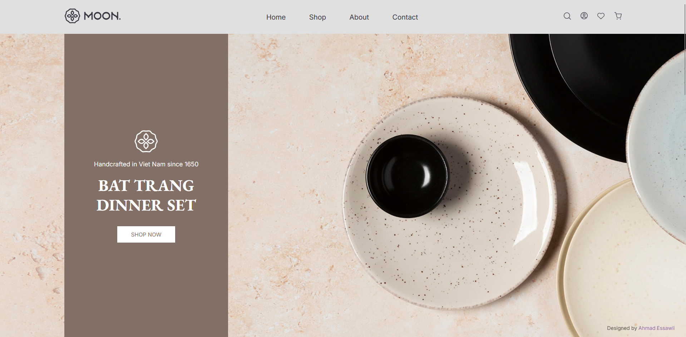

# 🌑 Moon Project

A web project developed as part of a bootcamp program.




## 🔗 Live Demo

[**View Live Demo Moon**](https://ahmadessawii06.github.io/Moon-Project-BootCamp/)

## 📋 Description

This is a Moon-themed project showcasing web development skills including HTML, CSS, and responsive design.

## 🎯 Features

- Clean and modern UI design
- Responsive layout
- Custom styling
- Organized project structure

## 📁 Project Structure

```
Moon-Project-BootCamp/
├── index.html      # Main HTML file
├── README.md       # This file
├── assets/         # Project assets (images, etc.)
└── styles/
    └── styles.css  # Custom stylesheets
```

## 🚀 Getting Started

1. Clone or download this repository
2. Open `index.html` in your web browser
3. Explore the project!

## 📝 Notes

1. This project is part of a bootcamp learning experience.
2. Instructor: Tareq-Shreem [**View Tareq-Shreem**](https://github.com/tariq-shreem).
3. The project is designed to demonstrate web development skills and creativity.
4. This project was taken in Ramadan month, in the last 10 days of Ramadan in 2026.
---

**Last Updated:** April 2026
